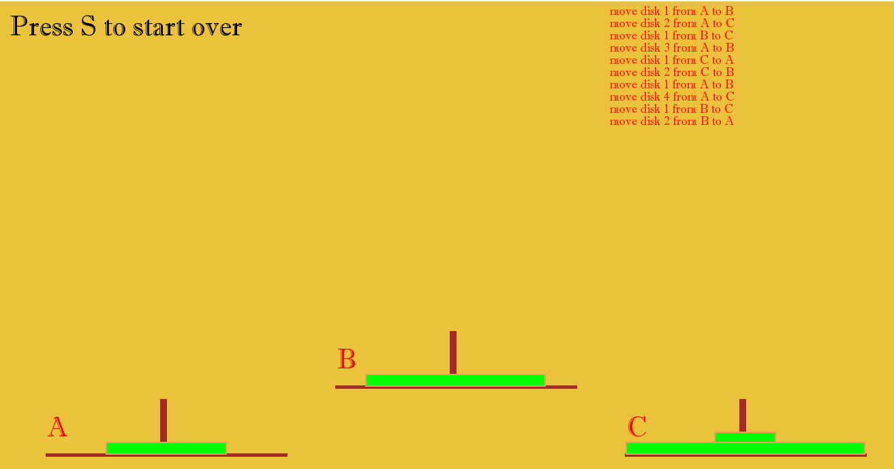

# H1 Tower-of-Hanoi-Visualizer

The Tower of Hanoi is one of the most popular puzzles of the nineteenth century. 
It consists of three pegs mounted on a board together and consists of disks of different sizes. 
At first, all the disks are kept on one peg(say peg 1) with the largest peg at the bottom and the size of pegs gradually decreases to the top.

# H2 AlGORITHM
We can think of the problem as two parts: one is the largest peg and the others. 
So, we first move n-1 disks ko aux peg and then the last to the destination peg.
And then the n-1 pegs to the destination again. So the entire problem can be broken into smaller and smaller parts recursively.
For eg the problem of moving n-1 peg to aux can be viewed with aux as the destination peg and the destination peg as the auxiliary peg and so on. 
So, we can too the full solution recursively with roles of pegs being changed for smaller number accordingly.

# H2 Technologies used
C++ with SFML library for graphics.

# Output
We can choose any number of disks and pegs we wish to visualize.
On pressing Spaces,the moves are graphically executed and moves are listed on screen.

